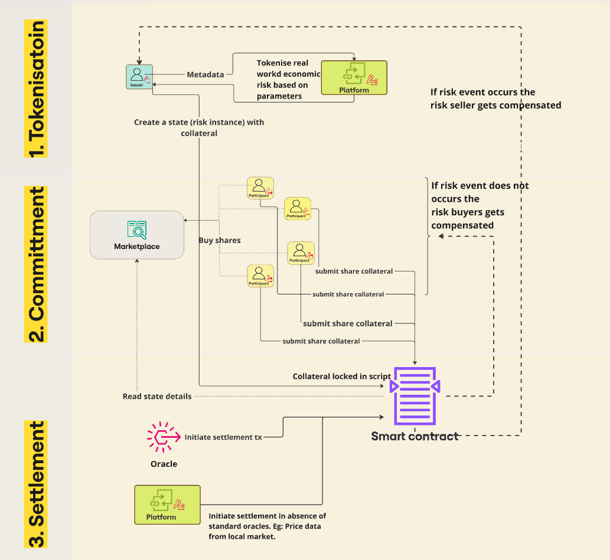

# _HedgeSphere_
## Decentralized Risk Sharing and Insurance Smart Contract

## Use Case
This smart contract facilitates risk-sharing between a **Risk Seller** and **Risk Takers** using a decentralized insurance model. The contract ensures fair distribution of funds based on a predefined risk event condition.

## Workflow

### 1. Risk Seller Setup
* **Mint Risk Shares**:
  * The Risk Seller creates shares representing the **total risk** being covered.
  * Example: 100 shares = Total coverage.
* **Post Collateral**:
  * The Risk Seller locks collateral in the contract.
  * Collateral amount is market-driven and determined by the seller's risk assessment. Provides a permissionless mechanism for creating risk-sharing opportunities.
  * Represents the initial insurance pool.
  * Example:
    * Total Shares: 100
    * Seller's Collateral: 10,000 SUI

### 2. Risk Takers Participation
* **Purchase Shares**:
  * Risk Takers buy shares in the smart contract.
  * Shares are purchased using SUI tokens.
  * Each share represents a proportional stake in the risk pool.
* **Example**:
  * Risk Taker A buys 35 shares
  * Risk Taker B buys 45 shares
  * 20 shares remains unsubscribed

### 3. Settlement Logic
At the end of the contract term, the settlement is determined by a boolean flag representing oracle-sourced or platform-provided risk event information.
* Can leverage:
  * Decentralized oracles for automated verification
  * The dapp platform supplying the information for event where oracles are not available/feasible.
  
#### Case 1: Risk Event Occurs, example: Rainfall > 60mm (crop loss)
* **Outcome**: The entire pool (collateral + buyer contributions) pays the Risk Seller.
* The Risk Seller receives all accumulated funds.

#### Case 2: No Risk Event, example Rainfall <= 60mm 
* **Outcome**: The Risk Seller's collateral is distributed among Risk Takers, proportional to the shares they hold.
* **Important consideration**:
Only the subscribed shares receive a proportional distribution of the collateral
Any unsubscribed shares' portion of the collateral returns to the Risk Seller
* Example:
  * Seller's collateral distributed:
    * Risk Taker A (35 shares) → Receives proportional share
    * Risk Taker B (45 shares) → Receives proportional share


### Diagram



## Key Features
- **Transparency:** Blockchain-based records create immutable, auditable risk-sharing transactions.


- **No Counterparty Risk:** Collateral locked in smart contract eliminates default risk for all participants.


- **Scalability:** This scheme supports obvious use cases like agricultural risk hedging and supply chain disruption, but its true strength lies in its flexibility, allowing users to create and customize solutions across diverse industries and risk scenarios.


- **Permissionless:** Anyone can participate, with the collateral amount determined by the seller. The higher the collateral, the more attractive the offer becomes, and there's no central control. We allow parameters to be driven by the market's own risk perceptions.

---------------------------------

### Specific Bugs and Hurdles
- **Object ID Not Populating in API Response:** After creating an object, the object ID was not appearing in the API response. By referring to examples provided by the SUI team, we updated the options passed in the transaction object, which resolved the issue.


- **Code for Iterating Through a Table:** Iterating through a table in place created compilation errors. We reached out to expert advisors from the SUI team, who helped us refactor the code to resolve the issue.


- **Typo in tha package name for Move Function Call:** We encountered a difficult-to-notice typo in the package used for the Move function call from TypeScript. Debugging this took longer than expected, eventually got over the hurdle with more Coffee!!
---------------------------------


# Sui dApp Starter Template

This dApp was created using `@mysten/create-dapp` that sets up a basic React
Client dApp using the following tools:

- [React](https://react.dev/) as the UI framework
- [TypeScript](https://www.typescriptlang.org/) for type checking
- [Vite](https://vitejs.dev/) for build tooling
- [Radix UI](https://www.radix-ui.com/) for pre-built UI components
- [ESLint](https://eslint.org/)
- [`@mysten/dapp-kit`](https://sdk.mystenlabs.com/dapp-kit) for connecting to
  wallets and loading data
- [pnpm](https://pnpm.io/) for package management

## Starting your dApp

To install dependencies you can run

```bash
pnpm install
```

To start your dApp in development mode run

```bash
pnpm dev
```

## Building

To build your app for deployment you can run

```bash
pnpm build
```
